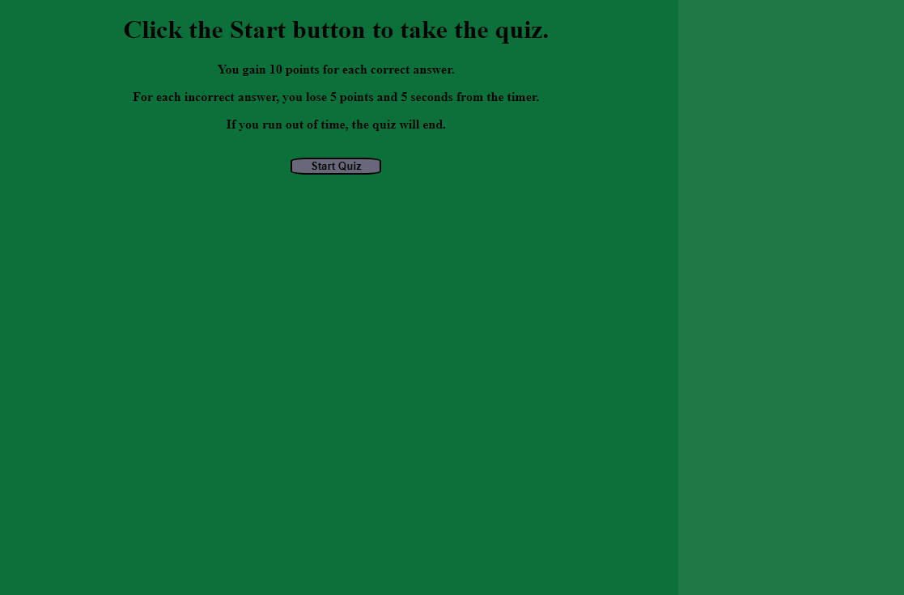

# Coding Quiz

A multiple-choice quiz with questions about JavaScript.

The quiz is on a 60-second timer, and awards 10 points per correct answer, with a penalty of 5 points and 5 seconds off the timer per incorrect answer. The quiz ends when the questions have all been answered correctly or when the timer runs out.

After the quiz, the user can input their initials, and a scoreboard is shown with the initials and score.

Link to deployed application:
https://connermart.github.io/module4challenge-quiz/
